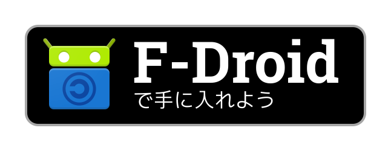

# Badge

Use the F-Droid badge on your site or README.md to indicate that your app is
available on the F-Droid main repository. Badges are listed below.


HTML code:

```html
<a href="https://f-droid.org/packages/YOUR.APP.ID">
    
</a>
```

Markdown code:

```markdown
[](https://f-droid.org/packages/YOUR.APP.ID)
```

Note that those code samples are to point people to the main F-Droid repository.
If you have your own F-Droid repository, you should tell people to
add your repository via a QR code instead. Such examples of landing pages for
third-party F-Droid repositories include:

* https://guardianproject.info/fdroid/
* https://microg.org/fdroid.html
* https://grobox.de/fdroid/
* https://fdroid.eutopia.cz/
* https://briarproject.org/fdroid.html

Generation
----------

The file `1-translate-svg.sh` will generate all translations based on the
source files in _badges/src/_, which is designed for the latin alphabet.
All other badges with left-to-right (LTR)
language-specific text at the top are generated from `get-it-on.svg`
(which is designed for English). Some badges have right-to-left (RTL) text.
For these badges, the Hebrew version is the source (see
`get-it-on-iw.svg`).

For some languages, the text goes at the bottom. For LTR the file
`src/get-it-on-uz.svg` for Uzbek is the souce. See te content of `1-translate-svg.sh`
for all other variations and source designs. The SG is optimized (dropping any
font dependencies) with `2-optimize-svg.sh`. The file `3-export-png.sh` will
export a PNG file for each SVG file.

Prerequisits
------------

    sudo apt-get install inkscape
    sudo npm install -g svgo

Important
---------

The original designs are in the `src` directory, being:
* `src/get-it-on.svg` also template for text at top and form LTR
* `src/get-it-on-iw.svg` text at top and from RTL
* `src/get-it-on-uz.svg` text at bottom and from LTR
* `src/get-it-on-eu.svg` text at top and at bottom and from LTR
* `src/get-it-on-fa.svg` text at top and at bottom from RTL (under construction)

If needed, only change those files. All other files are generated **and**
optimized SVG. All PNG files are also always generated.

Do not use a translation service to find additional translations. Proper
translations can be visually found at https://play.google.com/intl/en_us/badges/
but cannot digitally be copied-pasted from there to here. You will need to
input the transalted text manually in the translation script.

Designs
-------

Some specific examples are:





